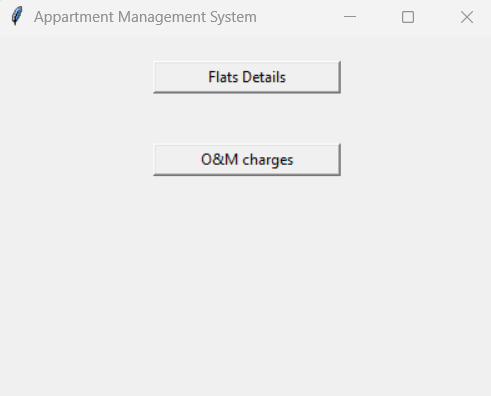
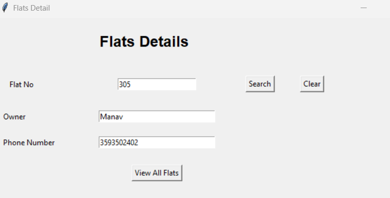
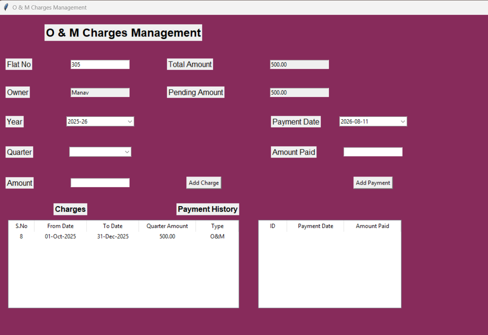
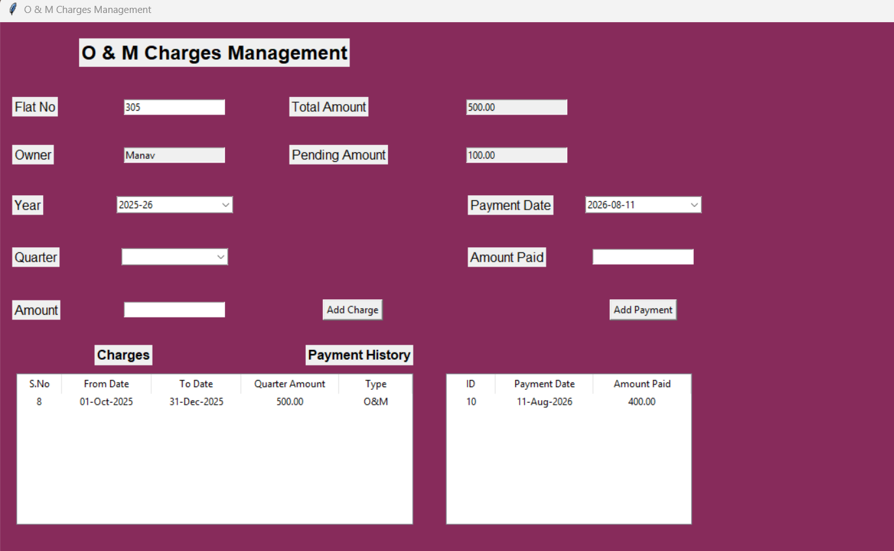
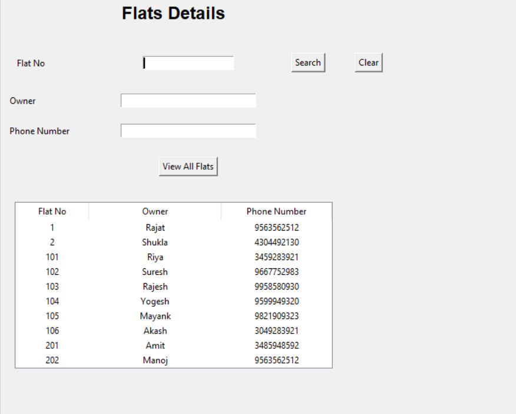

# 💰 O&M Charges Management System

A Python + MySQL application to manage yearly Operation & Maintenance (O&M) charges for apartments, including payment tracking and remaining dues calculation.

---

## 🚀 Features

- 🏢 Fetch owner details using flat number  
- 📅 Year-wise charge management (April–March cycle)  
- 💰 Track total payable and remaining dues  
- 📊 Quarterly payment records  
- 🧾 Handles O&M and miscellaneous charges  

---

## 🛠 Tech Stack

- **Language:** Python  
- **Database:** MySQL  
- **GUI:** Tkinter  

---

## 📂 Project Structure

- home.py        → Main application (GUI / entry point)
- db.py          → Database connection setup
- operations.py  → Core logic for O&M calculations and queries
- flats.py       → Handles flat/owner data retrieval
- insert_data.py → Script to insert initial/sample data
- om.py          → O&M charges management logic (yearly + quarterly)
- screenshots/   → Application UI images
  
---

## 📸 Screenshots

### 🏠 Home Screen


### 🔍 Search Flat


### 🧾 Add Charges


### 💳 Payment


### 📋 View Flats


---

## ▶️ How to Run

1. Clone the repository:
   ```bash
   git clone https://github.com/agrimmittal2510/om-charges-management.git
